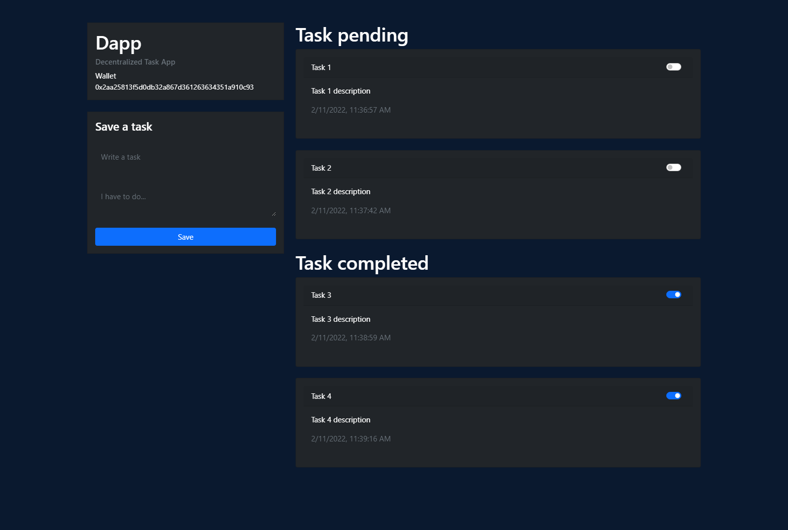

# Contract de tareas con solidity

## Este es un proyecto de un contrato de tareas creado con solidity

### Lo utilizado en el proyecto es:

- Contrato
    - Truffle → Para el deploy
    - Ganache → Para crear una testnet
    - Solidity
- Client
    - HTML, CSS, JS
    - Bootstrap
    - Server-lite
    - @truffle/contract
- Test
    - Mocha
    

